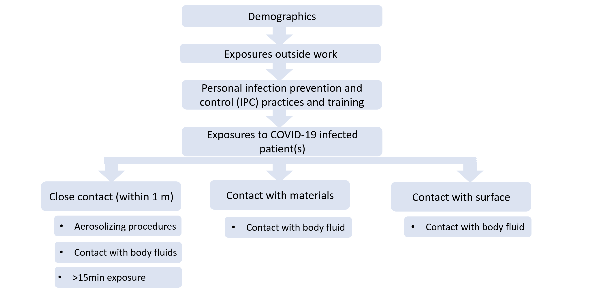

---
title: "Assessment of risk factors for coronavirus disease 2019 (COVID-19) in health workers <br> A WHO Multi-centre study <br> Analysis report (working)"
date: "`r Sys.Date()`"
author: 
---

```{r setup, include=FALSE}

rm(list = ls())

# load libraries and cleaning functions
path_to_functions <- here::here("~/Documents/nBox/git_projects/WHO_covid19_HCW_casecontrol/scripts")
scripts_files <- dir(path_to_functions, pattern = ".R$", full.names=TRUE)
for (file in scripts_files) source(file, local = TRUE)

## load data
# 1. import latest data from go.data
load(paste0('~/Desktop/covid-hcwcasecontrol-main/cleandata.Rdata'))

# remove entries with no case/control status
dat = dat[!is.na(dat$case_control),]

# set theme for plots 
theme_set(theme_minimal())

```


# Introduction 
This report documents the analysis working codes and results. It details the selection of variables and models which the sites may find helpful. This code may not be kept up to date with the main analysis code used for the overall study. Please adopt these codes at your own discretion. Please contact Mo Yin (email: yinm@who.int) for additional input.

</br>

General outline of the questionnaire is as follows. 

```{r qn, echo=FALSE, out.width = "60%", fig.align='center', fig.cap = "Questionnaire structure."}



```


## Models 

    * Model 1: Associations between demographic factors and IPC practices and COVID-19 infection ​
    
    * Model 2: Associations between individual IPC practices during high-risk exposures and COVID-19 infection​
    In the second set of models, exposure-specific protection and risk factors were evaluated. These include:
    
    * Close contact (within 1 metre) with the patient(s) 
    * Exposed to patient(s)' materials
    * Exposed to patient(s)' surrounding surfaces
    
    * Model 3: Associations between PPE during high-risk exposures and COVID-19 infection

Steps to choose variables: 

    1. Stratification table - check only levels present are there, data makes sense
    2. Univariate regression  - drop variables if stratification table showed <10% variation
    3. Multivariate regression
        * Model .1 = all sensible + significant (p value in univariate regression < 0.25)
        * Model .2 = check correlations with Cramer's V, remove those highly correlated 
        * Model .3 = further minimising variables  
    4. Check model fit with AIC/ BIC/ residuals

# Results {.tabset .tabset-pills}
```{r numbers, include=FALSE}
## n enrolled 
n_total = dim(dat)[1]
n_case_total = count_n(d = dat, outcome = 'total', participant.type = 'CASE')
n_control_total = count_n(d = dat, outcome = 'total', participant.type = 'CONTROL')

## excluded 
n_case_vacc = count_n(d = dat, outcome = 'vaccine2wks', participant.type = 'CASE')
n_case_nointer = count_n(d = dat, outcome = 'interviewmiss', participant.type = 'CASE')
n_control_vacc = count_n(d = dat, outcome = 'vaccine2wks', participant.type = 'CONTROL')
n_control_nointer = count_n(d = dat, outcome = 'interviewmiss', participant.type = 'CONTROL')
n_control_seropos = count_n(d = dat, outcome = 'serologypositive', participant.type = 'CONTROL')

## sensitivity analysis 
n_case_vaccmiss = count_n(d = dat, outcome = 'vaccinemiss', participant.type = 'CASE')
n_case_viro2wks = count_n(d = dat, outcome = 'virology2wks', participant.type = 'CASE')
n_case_viromiss = count_n(d = dat, outcome = 'virologymiss', participant.type = 'CASE')
n_control_vaccmiss = count_n(d = dat, outcome = 'vaccinemiss', participant.type = 'CONTROL')
n_control_seromiss = count_n(d = dat, outcome = 'serologymiss', participant.type = 'CONTROL')
n_control_seroincon = count_n(d = dat, outcome = 'serologyinconclusive', participant.type = 'CONTROL')

n_case_pp = count_n(d = dat, outcome = 'pp', participant.type = 'CASE')
n_control_pp = count_n(d = dat, outcome = 'pp', participant.type = 'CONTROL')

ppd = dat[which(dat$pp ==  1),]
serolag = summary(as.numeric(ppd$fu_sero_collection_date - ppd$init_sero_collection_date))

## change case control status to 1 and 2 
ppd$case_control = abs(as.numeric(as.factor(ppd$case_control)) - 2) + 1

## drop levels when not existent 
ppd$sex = factor(ppd$sex, levels = unique(ppd$sex))
ppd$hh_practice_avg = as.numeric(ppd$hh_practice_avg)

#### very few answered unknown in the high risk procedures (<5%) - classify `unknown` as `YES`
table(ppd$contact_1m_prolong15min)
ppd = classify_cat(ppd, 'contact_1m_prolong15min', 'UNKNOWN', 'NO')
table(ppd$contact_1m_bodyfld)
ppd = classify_cat(ppd, 'contact_1m_bodyfld','UNKNOWN', 'NO')
table(ppd$contact_1m_aerosol)
ppd = classify_cat(ppd, 'contact_1m_aerosol','UNKNOWN', 'NO')
table(ppd$contact_mat_bodyfld)
ppd = classify_cat(ppd, 'contact_mat_bodyfld','UNKNOWN', 'NO')
table(ppd$contact_surface_bodyfld)
ppd = classify_cat(ppd, 'contact_surface_bodyfld','UNKNOWN', 'NO')


#### handrub availability very few said no - classify No to OCCACIONALLY
table(ppd$hrub_avail_poc)
ppd = classify_cat(ppd, 'hrub_avail_poc','NO', 'OCCASIONALLY')
ppd = classify_cat(ppd, 'hrub_avail_poc','NOT SURE', 'OCCASIONALLY')

#### ppe availability very few said no - classify unknown to NO
table(ppd$ppe_avail)
ppd = classify_cat(ppd, 'ppe_avail','UNKNOWN', 'NO')

#### covid_specific_training very few said not sure - classify not sure to NO
table(ppd$covid_specific_training)
ppd = classify_cat(ppd, 'covid_specific_training','NOT SURE', 'NO')

#### contacts outside
table(ppd$contact_covid_outside)
ppd = classify_cat(ppd, 'contact_covid_outside','NOT SURE', 'YES')

#### HH before and after contact 1m 
table(ppd$contact_1m_hhbf)
ppd = classify_cat(ppd, 'contact_1m_hhbf', c('MOST OF THE TIME', 'OCCASIONALLY', 'RARELY', 'NEVER'), 'NOT ALWAYS')
table(ppd$contact_1m_hhaft)
ppd = classify_cat(ppd, 'contact_1m_hhaft', c('MOST OF THE TIME', 'OCCASIONALLY', 'RARELY', 'NEVER'), 'NOT ALWAYS')

```

## Study participants

## Model 1 

### Tabulation table 
`contact_covid_outside_persontype` is the only variable left out because:

```{r}
table(ppd$contact_covid_outside_persontype)
table(dat$contact_covid_outside_persontype)
```

```{r}
## ALL independent variables in model 1
table1(~ sex + age + education_cat + hcw_role_cat + 
         covid_specific_care_cat + covid_specific_care_days + 
         contact_1m_prolong15min + contact_1m_aerosol + contact_1m_bodyfld + contact_mat_bodyfld + 
         contact_surface_bodyfld + 
         hh_moments_aware_cat + hh_practice_avg + hh_moments_practice_cat + hrub_avail_poc + ppe_cat + ppe_avail + 
         ipc_pt_practice_cat + covid_specific_training + ipc_training_inperson +  ipc_training_latest + ipc_training_hours_cat +
         contact_covid_outside + public_transport_cat + contact_social_outside_cat | as.factor(case_control), data = ppd, overall = F,
       extra.col = list(`P-value`= pvalue))
```

### Univariate table 


```{r}

### gather all independent variables 
demo.var = c('sex', 'age', 'education_cat', 'hcw_role_cat')
risk.var = c('covid_specific_care_cat', 'covid_specific_care_days', 'contact_1m_prolong15min', 'contact_1m_aerosol', 'contact_1m_bodyfld', 'contact_mat_bodyfld', 'contact_surface_bodyfld')
per.ipc.var = c('hh_moments_aware_cat', 'hh_practice_avg', 'hh_moments_practice_cat', 'hrub_avail_poc', 'ppe_cat', 'ppe_avail')
train.ipc.var = c('ipc_pt_practice_cat', 'covid_specific_training', 'ipc_training_inperson', 'ipc_training_latest', 'ipc_training_hours_cat')
conf.var = c('contact_covid_outside', 'public_transport_cat', 'contact_social_outside_cat')
explanatory_vars = c(demo.var, risk.var, per.ipc.var, train.ipc.var, conf.var)
uv_out = uv_clogit(ppd, explanatory_vars)
as_hux(uv_out)

### statistically significant variables from univariate analysis 
uv_out[which(uv_out$p.value < 0.25),]
```

### Multivariate regressions

```{r}

mod1.1 = clogit(case_control ~ sex + age + education_cat + hcw_role_cat + 
                  #covid_specific_care_cat + covid_specific_care_days + 
                  contact_1m_prolong15min + contact_1m_aerosol + contact_1m_bodyfld + contact_mat_bodyfld + 
                  contact_surface_bodyfld + 
                  #hh_moments_aware_cat + 
                  hh_practice_avg + hh_moments_practice_cat + 
                  # hrub_avail_poc + 
                  ppe_cat + 
                  #ppe_avail + 
                  #ipc_pt_practice_cat + 
                  covid_specific_training + ipc_training_inperson + ipc_training_latest + ipc_training_hours_cat +
                  contact_covid_outside + public_transport_cat + contact_social_outside_cat + strata(site.godata), 
                data = ppd)

### gather all variables that are sensible and/or significant/ not highly correlated 
demo.var = c('sex', 'age', 'education_cat', 'hcw_role_cat')
risk.var = c('covid_specific_care_cat', 'contact_1m_prolong15min', 'contact_1m_aerosol', 'contact_1m_bodyfld', 'contact_mat_bodyfld', 'contact_surface_bodyfld')
per.ipc.var = c('hh_moments_aware_cat', 'hrub_avail_poc', 'ppe_cat', 'ppe_avail')
train.ipc.var = c('ipc_pt_practice_cat', 'covid_specific_training', 'ipc_training_inperson', 'ipc_training_hours_cat')
conf.var = c('contact_covid_outside', 'public_transport_cat', 'contact_social_outside_cat')
explanatory_vars = c(demo.var, risk.var, per.ipc.var, train.ipc.var, conf.var)
corrheat(ppd, explanatory_vars)

mod1.2 = clogit(case_control ~ sex + age + education_cat + hcw_role_cat + 
                  #covid_specific_care_cat + covid_specific_care_days + 
                  contact_1m_prolong15min + contact_1m_aerosol + 
                  #contact_1m_bodyfld + 
                  contact_mat_bodyfld + 
                  #contact_surface_bodyfld + 
                  #hh_moments_aware_cat + 
                  #hh_practice_avg + 
                  hh_moments_practice_cat + 
                  # hrub_avail_poc + 
                  ppe_cat + 
                  #ppe_avail + 
                  #ipc_pt_practice_cat + 
                  covid_specific_training + 
                  #ipc_training_inperson + ipc_training_latest + ipc_training_hours_cat +
                  contact_covid_outside + public_transport_cat + contact_social_outside_cat + strata(site.godata), 
                data = ppd)

mod1.3 = clogit(case_control ~ sex + age + 
                  #education_cat + hcw_role_cat + 
                  #covid_specific_care_cat + covid_specific_care_days + 
                  contact_1m_prolong15min + 
                  #contact_1m_aerosol + 
                  #contact_1m_bodyfld + 
                  contact_mat_bodyfld + 
                  #contact_surface_bodyfld + 
                  #hh_moments_aware_cat + 
                  #hh_practice_avg + 
                  hh_moments_practice_cat + 
                  # hrub_avail_poc + 
                  ppe_cat + 
                  #ppe_avail + 
                  #ipc_pt_practice_cat + 
                  covid_specific_training + 
                  #ipc_training_inperson + ipc_training_latest + ipc_training_hours_cat +
                  contact_covid_outside + public_transport_cat + contact_social_outside_cat + strata(site.godata), 
                data = ppd)


rbind(glance(mod1.1) %>% dplyr::select(r.squared, AIC, BIC, p.value.robust), 
      glance(mod1.2) %>% dplyr::select(r.squared, AIC, BIC, p.value.robust),
      glance(mod1.3) %>% dplyr::select(r.squared, AIC, BIC, p.value.robust))

```


### Choose final model 

```{r}
## choose the model 
tbl_regression(mod1.1, exponentiate = TRUE, 
               include = c(sex, age, education_cat, hcw_role_cat, 
                  #covid_specific_care_cat, covid_specific_care_days, 
                  contact_1m_prolong15min, contact_1m_aerosol, 
                  #contact_1m_bodyfld, 
                  contact_mat_bodyfld, 
                  #contact_surface_bodyfld, 
                  #hh_moments_aware_cat, 
                  hh_practice_avg, hh_moments_practice_cat, 
                  # hrub_avail_poc, 
                  ppe_cat, 
                  #ppe_avail, 
                  #ipc_pt_practice_cat, 
                  covid_specific_training
                  #ipc_training_inperson, ipc_training_latest, ipc_training_hours_cat
                  ))


# tbl_regression(mod1.2, exponentiate = TRUE)
# tbl_regression(mod1.3, exponentiate = TRUE)
```

## Model 2.1 Close contact within 1m

```{r, include=FALSE}
d_1m = ppd[which(ppd$contact_1m == 'YES'),]
```

`r nrow(d_1m)` (`r sum(d_1m$pp == 1 & d_1m$case_control == 1)` cases, `r sum(d_1m$pp == 1 & d_1m$case_control== 2)` controls) participants had close contact (within 1 metre) with the COVID-19 patient(s) since their admission. 

</br>

#### Tabulation table

```{r}
#  colnames(d_1m)[grep('_1m_', colnames(d_1m))]
# contact_1m_dur not included because contact_1m_prolong15min is an overlap

table1(~ contact_1m_prolong15min + contact_1m_hhbf + contact_1m_hhaft + contact_1m_aerosol + contact_1m_bodyfld + 
         contact_1m_no | as.factor(case_control), data = d_1m, overall = F,
       extra.col = list(`P-value`= pvalue))
```

### Univariate table 


```{r}

### gather all independent variables 
explanatory_vars = c('contact_1m_prolong15min', 'contact_1m_hhbf', 'contact_1m_hhaft', 'contact_1m_aerosol', 'contact_1m_bodyfld', 'contact_1m_no')
uv_out = uv_clogit(d_1m, explanatory_vars)
as_hux(uv_out)

### statistically significant variables from univariate analysis 
uv_out[which(uv_out$p.value < 0.25),]
```

### Multivariate regressions

```{r}

mod2.11 = clogit(case_control ~ contact_1m_prolong15min + contact_1m_no + contact_1m_aerosol + contact_1m_bodyfld + contact_1m_hhbf + contact_1m_hhaft + 
                   hh_moments_aware_cat +  covid_specific_training + 
                   contact_covid_outside + public_transport_cat + strata(site.godata), 
                 data = d_1m)

### gather all variables that are sensible and/or significant/ not highly correlated 
explanatory_vars = c('contact_1m_prolong15min', 'contact_1m_no', 'contact_1m_aerosol', 'contact_1m_bodyfld', 'contact_1m_hhbf', 
                     'contact_1m_hhaft', 'hh_moments_aware_cat',  'covid_specific_training', 
                     'contact_covid_outside', 'public_transport_cat',
                     
                     'hh_moments_aware_cat', 
                     'covid_specific_training')
corrheat(d_1m, explanatory_vars)

mod2.12 = clogit(case_control ~ contact_1m_prolong15min + contact_1m_no + contact_1m_aerosol + contact_1m_bodyfld + contact_1m_hhaft +
                   hh_moments_aware_cat +  covid_specific_training + 
                   contact_covid_outside + public_transport_cat + strata(site.godata), 
                 data = d_1m)

mod2.13 = clogit(case_control ~ contact_1m_prolong15min + contact_1m_no + contact_1m_aerosol + contact_1m_hhaft +
                   hh_moments_aware_cat +  covid_specific_training + 
                   contact_covid_outside + public_transport_cat + strata(site.godata), 
                 data = d_1m)


rbind(glance(mod2.11) %>% dplyr::select(r.squared, AIC, BIC, p.value.robust), 
      glance(mod2.12) %>% dplyr::select(r.squared, AIC, BIC, p.value.robust),
      glance(mod2.13) %>% dplyr::select(r.squared, AIC, BIC, p.value.robust))

```

### Choose final model 

```{r}
## choose the model 
tbl_regression(mod2.12, exponentiate = TRUE, 
               include = c(contact_1m_prolong15min, contact_1m_no, contact_1m_aerosol, contact_1m_bodyfld, contact_1m_hhaft))

#tbl_regression(mod2.11, exponentiate = TRUE)
#tbl_regression(mod2.13, exponentiate = TRUE)
```


## Model 2.2 Exposed to COVID-19 patients' materials 

```{r, include=FALSE}
d_mat = ppd[which(ppd$contact_mat == 'YES'),]
```

`r nrow(d_mat)` (`r sum(d_mat$pp == 1 & d_mat$case_control== 1)` cases, `r sum(d_mat$pp == 1 & d_mat$case_control== 2)` controls) participants were exposed to COVID-19 patient materials. 

</br>

#### Tabulation table

```{r}
#colnames(d_mat)[grep('_mat_', colnames(d_mat))]

table1(~ contact_mat_no + contact_mat_bodyfld + `contact_mat_typePersonal items` + `contact_mat_typeMedical devices used on the patient`  + contact_mat_typeClothes + contact_mat_typeLinen + `contact_mat_typeMedical equipment connected to the patient (e.g. ventilator, infusion pump etc.)` | as.factor(case_control), data = d_mat, overall = F,
       extra.col = list(`P-value`= pvalue))

```

### Univariate table 

```{r}

### gather all independent variables 
explanatory_vars = c('contact_mat_no', 'contact_mat_bodyfld', '`contact_mat_typePersonal items`', '`contact_mat_typeMedical devices used on the patient`', 'contact_mat_typeClothes','contact_mat_typeLinen', '`contact_mat_typeMedical equipment connected to the patient (e.g. ventilator, infusion pump etc.)`')
uv_out = uv_clogit(d_mat, explanatory_vars)
as_hux(uv_out)

### statistically significant variables from univariate analysis 
uv_out[which(uv_out$p.value < 0.25),]
```

### Multivariate regressions

```{r}

mod2.21 = clogit(case_control ~ contact_mat_no + contact_mat_bodyfld + `contact_mat_typePersonal items` + 
                   `contact_mat_typeMedical devices used on the patient` + contact_mat_typeClothes + 
                   contact_mat_typeLinen + 
                   `contact_mat_typeMedical equipment connected to the patient (e.g. ventilator, infusion pump etc.)` + 
                   hh_moments_aware_cat + covid_specific_training +
                   contact_covid_outside + public_transport_cat + strata(site.godata), 
                 data = d_mat)

### gather all variables that are sensible and/or significant/ not highly correlated 
explanatory_vars = c('contact_mat_no', 'contact_mat_bodyfld', 'contact_mat_typePersonal items', 'contact_mat_typeMedical devices used on the patient', 'contact_mat_typeClothes','contact_mat_typeLinen', 'contact_mat_typeMedical equipment connected to the patient (e.g. ventilator, infusion pump etc.)')
corrheat(d_mat, explanatory_vars)

mod2.22 = clogit(case_control ~ contact_mat_no + contact_mat_bodyfld + `contact_mat_typePersonal items` + contact_mat_typeClothes +
                   hh_moments_aware_cat +  covid_specific_training +  
                   contact_covid_outside + public_transport_cat + strata(site.godata), 
                 data = d_mat)

mod2.23 = clogit(case_control ~ contact_mat_no + contact_mat_bodyfld + `contact_mat_typePersonal items` + 
                   hh_moments_aware_cat +  covid_specific_training +  
                   contact_covid_outside + public_transport_cat + strata(site.godata), 
                 data = d_mat)


rbind(glance(mod2.21) %>% dplyr::select(r.squared, AIC, BIC, p.value.robust), 
      glance(mod2.22) %>% dplyr::select(r.squared, AIC, BIC, p.value.robust), 
      glance(mod2.23) %>% dplyr::select(r.squared, AIC, BIC, p.value.robust))

```

### Choose final model 

```{r}
## choose the model 
tbl_regression(mod2.23, exponentiate = TRUE, 
               include = c(contact_mat_no, 
                           contact_mat_bodyfld, 
                           `contact_mat_typePersonal items`))
#tbl_regression(mod2.21, exponentiate = TRUE)
#tbl_regression(mod2.22, exponentiate = TRUE)
```

## Model 2.3 Exposed to COVID-19 patients' surfaces

```{r, include=FALSE}
d_surf = ppd[which(ppd$contact_surface == 'YES'),]
```

`r nrow(d_surf)` (`r sum(d_surf$pp == 1 & d_surf$case_control== 1)` cases, `r sum(d_surf$pp == 1 & d_surf$case_control== 2)` controls) participants were exposed to COVID-19 patient surferials. 

</br>

#### Tabulation table

```{r}
#colnames(d_surf)[grep('_surface_', colnames(d_surf))]

table1(~ contact_surface_no + contact_surface_bodyfld + `contact_surface_typeWard corridor` + contact_surface_typeBed  + contact_surface_typeBathroom + `contact_surface_typePatient table` + `contact_surface_typeBedside table` + `contact_surface_typeDining table` + `contact_surface_typeMedical gas panel`| as.factor(case_control), data = d_surf, overall = F,
       extra.col = list(`P-value`= pvalue))

```

### Univariate table 

```{r}

### gather all independent variables 
explanatory_vars = c('contact_surface_no', 'contact_surface_bodyfld', '`contact_surface_typeWard corridor`', 'contact_surface_typeBed', 'contact_surface_typeBathroom', '`contact_surface_typePatient table`', '`contact_surface_typeBedside table`', '`contact_surface_typeDining table`', '`contact_surface_typeMedical gas panel`')
uv_out = uv_clogit(d_surf, explanatory_vars)
as_hux(uv_out)

### statistically significant variables from univariate analysis 
uv_out[which(uv_out$p.value < 0.25),]
```

### Multivariate regressions

```{r}

### gather all variables 
mod2.31 = clogit(case_control ~ contact_surface_no + contact_surface_bodyfld + `contact_surface_typeWard corridor` + 
                   contact_surface_typeBed  + contact_surface_typeBathroom +  `contact_surface_typeMedical gas panel` + 
                   hh_moments_aware_cat + covid_specific_training + 
                   contact_covid_outside + public_transport_cat + strata(site.godata), 
                 data = d_surf)

### gather all variables that are sensible and/or significant/ not highly correlated 
explanatory_vars = c('contact_surface_no', 'contact_surface_bodyfld', 'contact_surface_typeWard corridor', 'contact_surface_typeBed', 'contact_surface_typeBathroom',  'contact_surface_typeMedical gas panel')
corrheat(d_surf, explanatory_vars)

mod2.32 = clogit(case_control ~ contact_surface_no + contact_surface_bodyfld + `contact_surface_typeWard corridor` + 
                   contact_surface_typeBed  + contact_surface_typeBathroom + 
                   hh_moments_aware_cat + covid_specific_training + 
                   contact_covid_outside + public_transport_cat + strata(site.godata), 
                 data = d_surf)

mod2.33 = clogit(case_control ~ contact_surface_bodyfld + `contact_surface_typeMedical gas panel` + 
                   contact_surface_typeBed  + contact_surface_typeBathroom + 
                   hh_moments_aware_cat + covid_specific_training + 
                   contact_covid_outside + public_transport_cat + strata(site.godata), 
                 data = d_surf)


rbind(glance(mod2.31) %>% dplyr::select(r.squared, AIC, BIC, p.value.robust), 
      glance(mod2.32) %>% dplyr::select(r.squared, AIC, BIC, p.value.robust), 
      glance(mod2.33) %>% dplyr::select(r.squared, AIC, BIC, p.value.robust))

```

### Choose final model 

```{r}
## choose the model 
tbl_regression(mod2.33, exponentiate = TRUE, 
               include = c(contact_surface_bodyfld, 
                           `contact_surface_typeMedical gas panel`,
                           contact_surface_typeBed,
                           contact_surface_typeBathroom))

#tbl_regression(mod2.31, exponentiate = TRUE)
#tbl_regression(mod2.32, exponentiate = TRUE)
```


## Model 3.1 PPE during prolonged exposure to COVID-19 patients

```{r, include=FALSE}
d_1mprol = ppd[which(ppd$contact_1m_prolong15min == 'YES'),]
table(d_1mprol$contact_1m_prolong15min_ppe) # very few did not wear PPE

d_1mprol$contact_1m_prolong15min_ppe_typeRespandSurgmask = 'NO'
d_1mprol$contact_1m_prolong15min_ppe_typeRespandSurgmask[which(d_1mprol$`contact_1m_prolong15min_ppe_typeMedical/surgical mask` == 'YES' & 
                                                                 d_1mprol$`contact_1m_prolong15min_ppe_typeRespirator (e.g. N95, FFP2 or equivalent)` == 'YES')] = 'YES'

d_1mprol$contact_1m_prolong15min_ppe_typeResponly = 'NO'
d_1mprol$contact_1m_prolong15min_ppe_typeResponly[which(d_1mprol$`contact_1m_prolong15min_ppe_typeMedical/surgical mask` == 'NO' & 
                                                          d_1mprol$`contact_1m_prolong15min_ppe_typeRespirator (e.g. N95, FFP2 or equivalent)` == 'YES')] = 'YES'

d_1mprol$contact_1m_prolong15min_ppe_typeMaskonly = 'NO'
d_1mprol$contact_1m_prolong15min_ppe_typeResponly[which(d_1mprol$`contact_1m_prolong15min_ppe_typeMedical/surgical mask` == 'YES' & 
                                                          d_1mprol$`contact_1m_prolong15min_ppe_typeRespirator (e.g. N95, FFP2 or equivalent)` == 'NO')] = 'YES'

d_1mprol$contact_1m_prolong15min_ppe_typeRespandSurgmasknone = 'NO'
d_1mprol$contact_1m_prolong15min_ppe_typeResponly[which(d_1mprol$`contact_1m_prolong15min_ppe_typeMedical/surgical mask` == 'NO' & 
                                                          d_1mprol$`contact_1m_prolong15min_ppe_typeRespirator (e.g. N95, FFP2 or equivalent)` == 'NO')] = 'YES'
```

`r nrow(d_1mprol)` (`r sum(d_1mprol$pp == 1 & d_1mprol$case_control== 1)` cases, `r sum(d_1mprol$pp == 1 & d_1mprol$case_control== 2)` controls) participants had prolonged exposure to COVID-19 patients. 

</br>

#### Tabulation table

```{r}
#colnames(d_1mprol)[grep('_1m_prolong', colnames(d_1mprol))]

table1(~ contact_1m_prolong15min_ppe_type_gloveremoveaft + contact_1m_prolong15min_ppe_type_resptestfit + `contact_1m_prolong15min_ppe_typeFace shield` + contact_1m_prolong15min_ppe_typeGloves + contact_1m_prolong15min_ppe_typeCoverall + `contact_1m_prolong15min_ppe_typeHead cover` + `contact_1m_prolong15min_ppe_typeRespirator (e.g. N95, FFP2 or equivalent)` + `contact_1m_prolong15min_ppe_typeShoe covers` + `contact_1m_prolong15min_ppe_typeMedical/surgical mask` + `contact_1m_prolong15min_ppe_typeGoggles/glasses` + contact_1m_prolong15min_ppe_typeGown + contact_1m_prolong15min_ppe_typeRespandSurgmasknone + 
         contact_1m_prolong15min_ppe_typeRespandSurgmask + 
         contact_1m_prolong15min_ppe_typeResponly + 
         contact_1m_prolong15min_ppe_typeMaskonly| as.factor(case_control), data = d_1mprol, overall = F,
       extra.col = list(`P-value`= pvalue))

```

### Univariate table 

```{r}

### gather all independent variables 
explanatory_vars = c('`contact_1m_prolong15min_ppe_typeFace shield`', 
                     'contact_1m_prolong15min_ppe_typeGloves', 
                     'contact_1m_prolong15min_ppe_typeCoverall', 
                     '`contact_1m_prolong15min_ppe_typeHead cover`', 
                     '`contact_1m_prolong15min_ppe_typeRespirator (e.g. N95, FFP2 or equivalent)`', 
                     '`contact_1m_prolong15min_ppe_typeShoe covers`', 
                     '`contact_1m_prolong15min_ppe_typeMedical/surgical mask`', 
                     'contact_1m_prolong15min_ppe_typeRespandSurgmask',
                     '`contact_1m_prolong15min_ppe_typeGoggles/glasses`',
                     'contact_1m_prolong15min_ppe_typeGown')
uv_out = uv_clogit(d_1mprol, explanatory_vars)
as_hux(uv_out)

### statistically significant variables from univariate analysis 
uv_out[which(uv_out$p.value < 0.25),]
```

### Multivariate regressions

Not done because PPE items completely correlated. 

```{r}

# mod3.11 = clogit(case_control ~ contact_1m_prolong15min_ppe_typeRespandSurgmask +
#                    `contact_1m_prolong15min_ppe_typeGoggles/glasses` + 
#                    contact_1m_prolong15min_ppe_typeGown + 
#                    hh_moments_aware_cat + covid_specific_training + 
#                    contact_covid_outside + public_transport_cat + strata(site.godata), 
#               data = d_1mprol)

### gather all variables that are sensible and/or significant/ not highly correlated 
explanatory_vars = c('contact_1m_prolong15min_ppe_typeRespandSurgmask', 
                     'contact_1m_prolong15min_ppe_typeGoggles/glasses',
                     'contact_1m_prolong15min_ppe_typeGown',
                     'hh_moments_aware_cat', 
                     'covid_specific_training')
corrheat(d_1mprol, explanatory_vars) ## all highly correlated 

# mod3.12 = clogit(case_control ~ contact_1m_prolong15min_ppe_typeGloves + contact_1m_prolong15min_ppe_typeCoverall + `contact_1m_prolong15min_ppe_typeRespirator (e.g. N95, FFP2 or equivalent)`  + `contact_1m_prolong15min_ppe_typeMedical/surgical mask` + `contact_1m_prolong15min_ppe_typeGoggles/glasses` + hh_moments_aware_cat + ipc_pt_practice_cat + covid_specific_training  + strata(site.godata), 
#                  data = d_1mprol)
# 
# rbind(glance(mod3.11) %>% dplyr::select(r.squared, AIC, BIC, p.value.robust), 
#       glance(mod3.12) %>% dplyr::select(r.squared, AIC, BIC, p.value.robust))

```

### Choose final model 

```{r}
## choose the model 
# tbl_regression(mod3.12, exponentiate = TRUE, 
#                include = c(contact_1m_prolong15min_ppe_typeGloves,
#                            contact_1m_prolong15min_ppe_typeCoverall,
#                            `contact_1m_prolong15min_ppe_typeRespirator (e.g. N95, FFP2 or equivalent)`,
#                            `contact_1m_prolong15min_ppe_typeMedical/surgical mask`,
#                            `contact_1m_prolong15min_ppe_typeGoggles/glasses`))
```

## Model 3.2 PPE during aerosol procedures for COVID-19 patients

```{r, include=FALSE}
d_1maer = ppd[which(ppd$contact_1m_aerosol == 'YES'),]
table(d_1maer$contact_1m_aerosol_ppe) # very few did not wear PPE


d_1maer$contact_1m_aerosol_ppe_typeRespandSurgmask = 'NO'
d_1maer$contact_1m_aerosol_ppe_typeRespandSurgmask[which(d_1maer$`contact_1m_aerosol_ppe_typeMedical/surgical mask` == 'YES' & 
                                                           d_1maer$`contact_1m_aerosol_ppe_typeRespirator (e.g. N95, FFP2 or equivalent)` == 'YES')] = 'YES'

d_1maer$contact_1m_aerosol_ppe_typeResponly = 'NO'
d_1maer$contact_1m_aerosol_ppe_typeResponly[which(d_1maer$`contact_1m_aerosol_ppe_typeMedical/surgical mask` == 'NO' & 
                                                    d_1maer$`contact_1m_aerosol_ppe_typeRespirator (e.g. N95, FFP2 or equivalent)` == 'YES')] = 'YES'

d_1maer$contact_1m_aerosol_ppe_typeMaskonly = 'NO'
d_1maer$contact_1m_aerosol_ppe_typeResponly[which(d_1maer$`contact_1m_aerosol_ppe_typeMedical/surgical mask` == 'YES' & 
                                                    d_1maer$`contact_1m_aerosol_ppe_typeRespirator (e.g. N95, FFP2 or equivalent)` == 'NO')] = 'YES'

d_1maer$contact_1m_aerosol_ppe_typeRespandSurgmasknone = 'NO'
d_1maer$contact_1m_aerosol_ppe_typeResponly[which(d_1maer$`contact_1m_aerosol_ppe_typeMedical/surgical mask` == 'NO' & 
                                                    d_1maer$`contact_1m_aerosol_ppe_typeRespirator (e.g. N95, FFP2 or equivalent)` == 'NO')] = 'YES'

```

`r nrow(d_1maer)` (`r sum(d_1maer$pp == 1 & d_1maer$case_control== 1)` cases, `r sum(d_1maer$pp == 1 & d_1maer$case_control== 2)` controls) participants had aerosol exposure to COVID-19 patients. 

</br>

#### Tabulation table

```{r}
#colnames(d_1maer)[grep('_1m_aerosol', colnames(d_1maer))]

table1(~ `contact_1m_aerosol_ppe_typeFace shield` + contact_1m_aerosol_ppe_typeGloves + contact_1m_aerosol_ppe_typeCoverall + `contact_1m_aerosol_ppe_typeHead cover`  + `contact_1m_aerosol_ppe_typeShoe covers` + contact_1m_aerosol_ppe_typeRespandSurgmask + contact_1m_aerosol_ppe_typeRespandSurgmasknone + contact_1m_aerosol_ppe_typeResponly + contact_1m_aerosol_ppe_typeMaskonly +
         `contact_1m_aerosol_ppe_typeGoggles/glasses` + contact_1m_aerosol_ppe_typeGown | as.factor(case_control), data = d_1maer, overall = F,
       extra.col = list(`P-value`= pvalue))

```

### Univariate table 

```{r}

### gather all independent variables 
explanatory_vars = c('`contact_1m_aerosol_ppe_typeFace shield`', 
                     'contact_1m_aerosol_ppe_typeGloves', 
                     'contact_1m_aerosol_ppe_typeCoverall', 
                     '`contact_1m_aerosol_ppe_typeHead cover`', 
                     'contact_1m_aerosol_ppe_typeResponly', 
                     '`contact_1m_aerosol_ppe_typeShoe covers`', 
                     '`contact_1m_aerosol_ppe_typeGoggles/glasses`',
                     'contact_1m_aerosol_ppe_typeGown')
uv_out = uv_clogit(d_1maer, explanatory_vars)
as_hux(uv_out)

### statistically significant variables from univariate analysis 
uv_out[which(uv_out$p.value < 0.25),]
```

### Multivariate regressions

```{r}

### gather all variables 
mod3.21 = clogit(case_control ~  contact_1m_aerosol_ppe_typeResponly  + 
                   hh_moments_aware_cat + covid_specific_training + strata(site.godata), 
                 data = d_1maer)

### gather all variables that are sensible and/or significant/ not highly correlated 
explanatory_vars = c('contact_1m_aerosol_ppe_typeResponly', 
                     'hh_moments_aware_cat', 
                     'covid_specific_training')
corrheat(d_1maer, explanatory_vars)

```

### Choose final model 

```{r}
## choose the model 
tbl_regression(mod3.21, exponentiate = TRUE, 
               include = c(contact_1m_aerosol_ppe_typeResponly))
```

## Model 3.3 PPE during contact with patients' materials soiled with body fluid 

```{r, include=FALSE}
d_matbf = ppd[which(ppd$contact_mat_bodyfld == 'YES'),]
table(d_matbf$contact_mat_bodyfld_ppe) # very few did not wear PPE
```

`r nrow(d_matbf)` (`r sum(d_matbf$pp == 1 & d_matbf$case_control== 1)` cases, `r sum(d_matbf$pp == 1 & d_matbf$case_control== 2)` controls) participants had aerosol exposure to COVID-19 patients. 

</br>

#### Tabulation table

```{r}
#colnames(d_matbf)[grep('_mat_body', colnames(d_matbf))]

table1(~ contact_mat_bodyfld_hhbf_cat + contact_mat_bodyfld_hhaft_cat + contact_mat_bodyfld_ppe_type_gloveremoveaft + `contact_mat_bodyfld_ppeFace shield` + contact_mat_bodyfld_ppeGloves + contact_mat_bodyfld_ppeCoverall + `contact_mat_bodyfld_ppeHead cover` + `contact_mat_bodyfld_ppeShoe covers` + `contact_mat_bodyfld_ppeRespirator (e.g. N95, FFP2 or equivalent)` + `contact_mat_bodyfld_ppeMedical/surgical mask` +
         `contact_mat_bodyfld_ppeGoggles/glasses` + contact_mat_bodyfld_ppeGown | as.factor(case_control), data = d_matbf, overall = F,
       extra.col = list(`P-value`= pvalue))

```

### Univariate table 

```{r}

### gather all independent variables 
explanatory_vars = c('`contact_mat_bodyfld_ppeFace shield`', 
                     'contact_mat_bodyfld_ppeCoverall', 
                     '`contact_mat_bodyfld_ppeRespirator (e.g. N95, FFP2 or equivalent)`',
                     '`contact_mat_bodyfld_ppeMedical/surgical mask`',
                     '`contact_mat_bodyfld_ppeShoe covers`', 
                     '`contact_mat_bodyfld_ppeGoggles/glasses`',
                     'contact_mat_bodyfld_ppeGown')
uv_out = uv_clogit(d_matbf, explanatory_vars)
as_hux(uv_out)

### statistically significant variables from univariate analysis 
uv_out[which(uv_out$p.value < 0.25),]
```

### Multivariate regressions

```{r}

### gather all variables 
mod3.31 = clogit(case_control ~ `contact_mat_bodyfld_ppeRespirator (e.g. N95, FFP2 or equivalent)` + 
                   #`contact_mat_bodyfld_ppeMedical/surgical mask` +
                   contact_mat_bodyfld_ppeGown +
                   hh_moments_aware_cat + covid_specific_training + strata(site.godata), 
                 data = d_matbf) ## unable to converge even with the minimal model 

### gather all variables that are sensible and/or significant/ not highly correlated 
# explanatory_vars = c('contact_mat_bodyfld_ppeFace shield', 
#                      'contact_mat_bodyfld_ppeCoverall', 
#                      'contact_mat_bodyfld_ppeRespirator (e.g. N95, FFP2 or equivalent)',
#                      'contact_mat_bodyfld_ppeMedical/surgical mask',
#                      'contact_mat_bodyfld_ppeShoe covers', 
#                      'contact_mat_bodyfld_ppeGoggles/glasses',
#                      'contact_mat_bodyfld_ppeGown')
# corrheat(d_matbf, explanatory_vars)
# 
# mod3.32 = clogit(case_control ~ `contact_mat_bodyfld_ppeMedical/surgical mask` +
#                      `contact_mat_bodyfld_ppeGoggles/glasses` +
#                    hh_moments_aware_cat + covid_specific_training + strata(site.godata), 
#                  data = d_matbf)
# 
# rbind(glance(mod3.31) %>% dplyr::select(r.squared, AIC, BIC, p.value.robust), 
#       glance(mod3.32) %>% dplyr::select(r.squared, AIC, BIC, p.value.robust))

```

### Choose final model 

```{r}
## choose the model 
# tbl_regression(mod3.22, exponentiate = TRUE, 
#                include = c(contact_mat_bodyfld_ppe_typeResponly))
```


## Model 3.4 PPE during contact with patients' surfaces soiled with body fluid 

Missing data - unable to perform analysis

## HCF information 

when duplicated, latest entry taken into consideration.

```{r, include=F}

h = ppd[, c(which(colnames(ppd) == 'init_form_date'), grep('hcf_', colnames(ppd)))]
h = h[, -which(colnames(h) %in% c('init_hcf_name', 'fu_hcf_name', 'hcf_form'))]
h = unique(h)
h = h[order(h$init_form_date),]
h = h[order(h$hcf_form_hcf_name),]

h = h[table(h$hcf_form_hcf_name),]

```

```{r}
#colnames(h)

table1(~ hcf_type + hcf_size + hcf_covidpt + hcf_covidbedno + hcf_coviddedicatedtriage + 
         hcf_coviddedicatedstaff + hcf_coviddedicatedstaff_no  + hcf_screen + hcf_univmask +
         hcf_wash + hcf_ipcguideline + hcf_ipctransmissionbased + hcf_ipctraining + hcf_ppeavail + 
         hcf_ppesufficient+ hcf_ppequality + hcf_alcavail + hcf_soapavail + hcf_hhaudit + hcf_ipcaudit + 
         hcf_haisurv_pt + hcf_haisurv_hcw+hcf_screenonarrival + hcf_covidalert+ hcf_triage + 
         hcf_covidisolatearrival + hcf_covidptmask + hcf_staffing + hcf_bedcapacity + hcf_screen_freq1 +
         hcf_screen_freq2 + `hcf_ipcprogramIPC programme` + `hcf_ipcprogramIPC team/service` + 
         `hcf_ipcprogramIPC focal point` + `hcf_ipcprogramIPC training` + `hcf_ipcprogramI don’t know what an IPC programme is` +
         `hcf_alcavail_whereIn every room` + `hcf_alcavail_whereIn every ward (corridors)` + 
         `hcf_alcavail_whereNext to each bed`, data = h, overall = T)


```